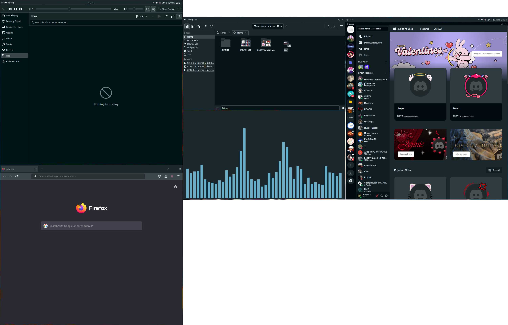

# my dotfiles



## Features

- multi monitor
- wallpaper color palette [thanks to rpaper](https://github.com/Prepodobnuy/rpaper)
- wasd navigation in hyprland, helix
- rofi wallpaper choose menu

## Color theme affects:

- qt apps
- vesktop
- alacritty
- rofi
- swaync
- waybar
- gtk3/gtk3+ apps [thanks to oomox-gtk-theme](https://github.com/themix-project/oomox-gtk-theme)

## Installation dependencies

- paru
- git
- python

## Installation

```sh
git clone https://github.com/Prepodobnuy/dotfiles.git
cd dotfiles
python install.sh
cd ..
rm -r dotfiles
```
